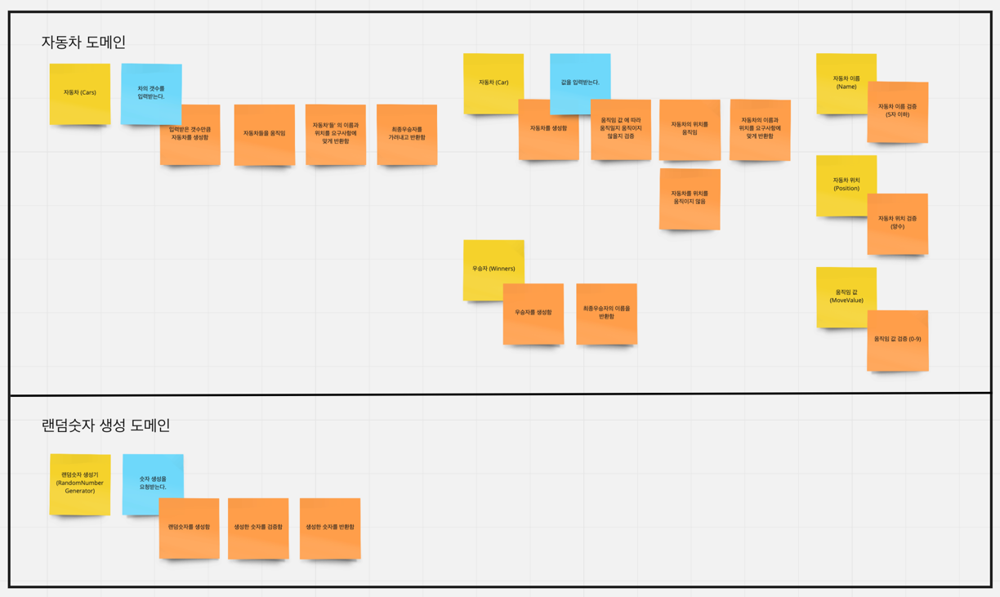
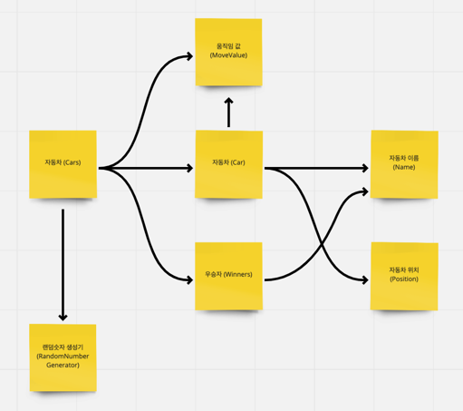

# 자동차 경주 게임
## 자동차 경주 게임 설명
자동차 경주게임은 경주 할 자동차의 이름을 입력받고, 시도할 횟수를 입력받아 가장 멀리간 자동차가 승리하는 게임입니다.

---
### 1. 실행 방법 및 결과
#### 1. 자동차 경주게임은 경주 할 자동차의 이름을 입력받습니다. 
- 자동차의 이름은 쉼표(,) 를 기준으로 구분하며, 띄어쓰기는 허용하지 않습니다.
- 자동차당 최대 5글자까지만 입력가능합니다.

실행하면 아래와 같은 화면에서 자동차의 이름을 입력합니다.
```
(출력) 경주 할 자동차 이름을 입력하세요. (이름은 쉼표(,) 기준으로 구분)
(입력) lee,suk,june  
```

#### 2. 자동차 경주게임을 시도할 횟수를 입력받습니다.
- 1 이상의 양의숫자를 입력해야합니다.
- 양의숫자를 입력한 만큼 랜덤하게 경주할 자동차들이 이동합니다.

실행하면 아래와 같은 화면에서 시도할 횟수를 입력합니다.
```
(출력) 시도할 회수는 몇회인가요?
(입력) 5
```

#### 3. 실행결과가 시도회수만큼 출력되며, 최종 우승자가 출력됩니다.
```
실행결과
lee : -
suk : -
june : 
...

실행결과
lee : ----
suk : ---
june : ----

최종 우승자: lee, june
```
---
### 이벤트 스토밍을 통한 도메인 구분
```
파란색 : command or acction
주황색 : event
노란색 : domain
구분된 선 : Bounded Context
```

### 도메인 간 의존성 다이어그램

---
### 기능 요구사항 작성
- [x] 자동차 이름 객체를 생성한다.
- [x] 자동차 위치 객체를 생성한다.
- [x] 자동차 객체를 생성한다.
- [x] 자동차 한대를 앞으로 전진한다.
- [x] 자동차 한대의 이름과 위치를 요구사항에 맞게 반환한다.
- [x] 자동차들 객체를 생성한다.
- [x] 자동차들을 움직인다.
- [x] 자동차들의 이름과 위치를 요구사항에 맞게 반환한다.
- [x] 두 자동차 위치 객체 중, 더 큰 자동차 위치객체를 반환한다.
- [x] 두 자동차 중, 더 큰 위치값을 가진 자동차의 위치객체를 반환한다.
- [x] 자동차들 중, 가장 큰 위치값이 몇인지 판별한다.
- [x] 자동차들 중, 최종우승자를 반환한다.
- [x] 숫자생성 도메인 객체를 생성한다.
- [x] 랜덤값을 반환하는 서비스를 구현한다.
- [x] 자동차가 랜덤값을 받아 움직이는 전략을 구현한다.
- [x] 자동차들이 랜덤값을 받아 움직이도록 구현한다.
- [x] 승리자 도메인 객체를 생성한다.
- [ ] 승리자 도메인은 승리자를 요구사항에 맞게 반환한다.
- [ ] 경주할 자동차의 이름과 시도할 횟수를 입력받는다.
- [ ] 출력문구를 요구사항에 맞게 출력한다.